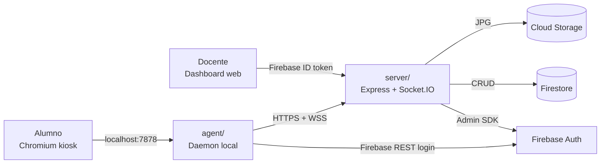
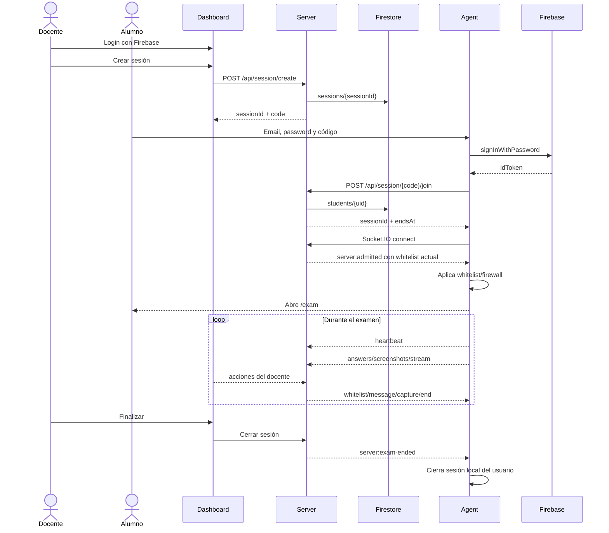
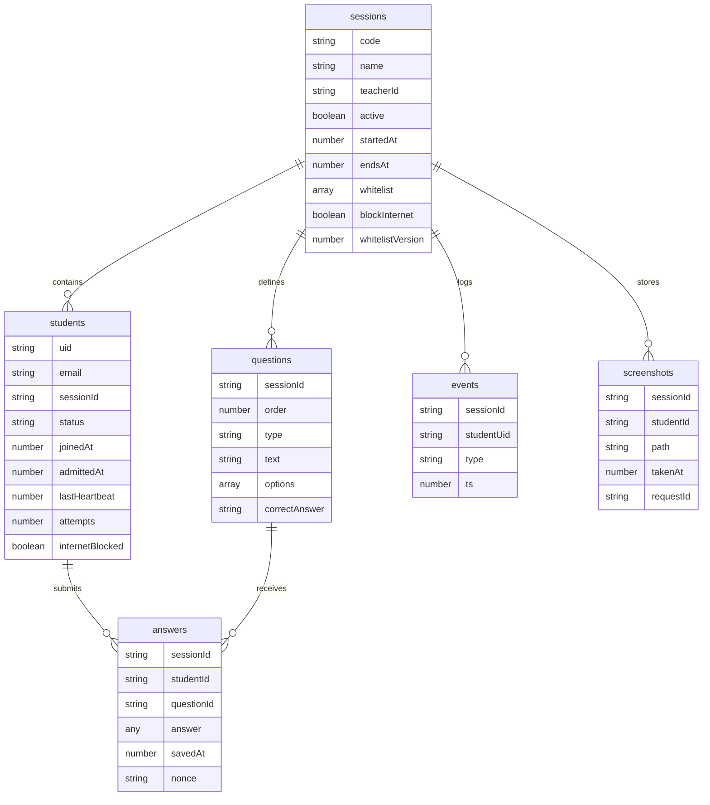
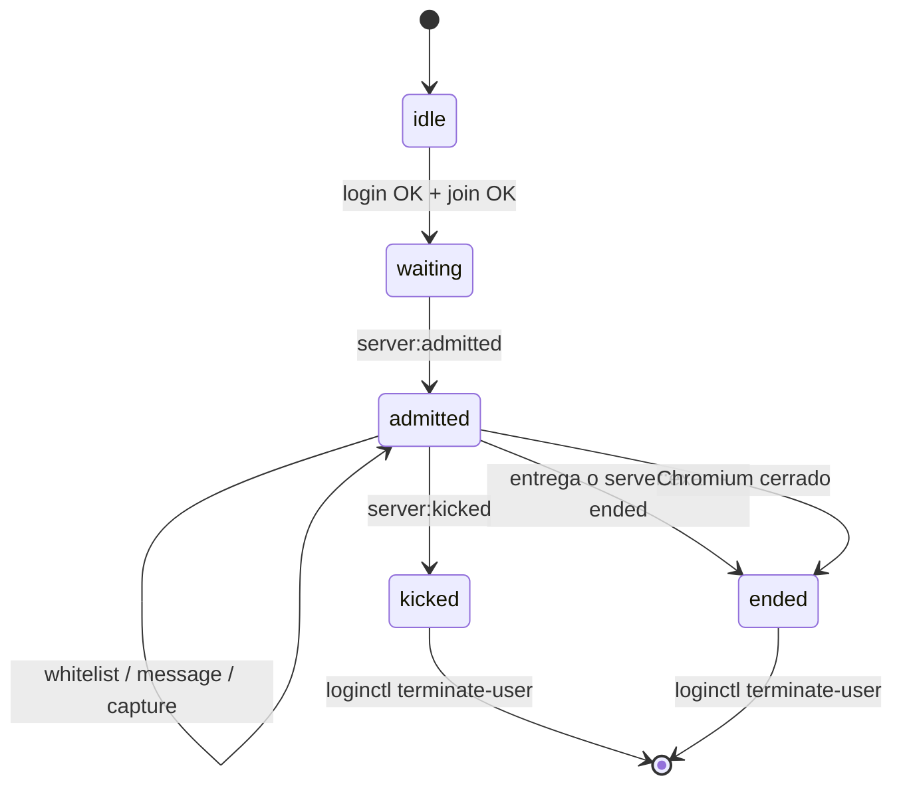

# Aplicación

## Resumen

ExamLock separa la aplicación en tres piezas:

- **Dashboard docente**: crea sesiones, configura la whitelist, monitorea alumnos, pide capturas, envía mensajes y revisa auditoría/resultados.
- **Server**: valida tokens Firebase, aplica permisos por rol, persiste Firestore, publica eventos por Socket.IO y guarda capturas en Cloud Storage.
- **Agent del alumno**: corre localmente en el entorno controlado, sirve la UI del examen y ejecuta restricciones de red/captura.

## Roles

| Rol | Dónde se define | Qué puede hacer |
|---|---|---|
| `teacher` | Custom claim de Firebase Auth | Crear sesiones, listar sus sesiones, monitorear alumnos, pedir capturas, editar whitelist, cerrar sesiones. |
| `student` | Custom claim de Firebase Auth | Entrar a una sesión activa con código, responder examen y enviar eventos/capturas desde el agent. |

El server no confía en el cliente. Cada endpoint protegido valida el token Firebase y revisa el rol antes de operar.

## Flujo de sesión

## Pantallas del alumno

| Archivo | Uso |
|---|---|
| `agent/ui/login.html` | Login con correo, password y código de sesión. |
| `agent/ui/waiting.html` | Espera/estado mientras el agent sincroniza. |
| `agent/ui/exam.html` | Examen activo. Consume preguntas y guarda respuestas. |
| `agent/ui/ended.html` | Pantalla final cuando entrega o el docente termina. |

El daemon sirve esas pantallas en `127.0.0.1:7878`; Chromium kiosk solo apunta a esa dirección local.

## Datos principales

## Endpoints principales

| Método | Ruta | Rol | Uso |
|---|---|---|---|
| `POST` | `/api/session/create` | teacher | Crea sesión y genera código. |
| `GET` | `/api/session` | teacher | Lista sesiones del docente. |
| `GET` | `/api/session/id/:id` | teacher | Obtiene resumen de una sesión. |
| `GET` | `/api/session/:code` | público | Valida un código activo. |
| `POST` | `/api/session/:code/join` | student | Une alumno a la sesión. |
| `GET` | `/api/session/:id/students` | teacher | Lista alumnos para monitor. |
| `PUT` | `/api/session/:id/whitelist` | teacher | Actualiza dominios permitidos. |
| `POST` | `/api/session/:id/screenshot-all` | teacher | Pide capturas a alumnos activos. |
| `GET` | `/api/session/:id/audit` | teacher | Devuelve datos de auditoría. |
| `POST` | `/api/student/:uid/kick` | teacher | Expulsa alumno. |
| `POST` | `/api/student/:uid/readmit` | teacher | Reactiva alumno. |
| `POST` | `/api/student/:uid/message` | teacher | Envía overlay/mensaje. |
| `POST` | `/api/exam/:sessionId/questions` | teacher | Carga preguntas. |
| `GET` | `/api/exam/:sessionId` | container/student token | Obtiene preguntas sin respuestas correctas. |
| `POST` | `/api/exam/:sessionId/answer` | container/student token | Guarda o actualiza respuesta. |

## Eventos Socket.IO principales

| Evento | Origen | Destino | Uso |
|---|---|---|---|
| `server:admitted` | server | agent | Entrega whitelist, bloqueo de internet y fin de sesión. |
| `server:whitelist` | server | agent | Actualiza red durante el examen. |
| `server:capture-now` | server | agent | Pide screenshot bajo demanda. |
| `server:stream-start` | server | agent | Inicia stream hacia un docente. |
| `server:message` | server | agent | Muestra mensaje overlay al alumno. |
| `server:kicked` | server | agent | Expulsa y cierra la sesión local. |
| `server:exam-ended` | server | agent | Termina el examen y cierra la sesión local. |
| `student:heartbeat` | agent | server | Mantiene estado online. |
| `student:screenshot` | agent | server | Envía captura JPG. |
| `student:stream-frame` | agent | server | Envía frame de stream. |
| `student:closed` | agent | server | Informa cierre/entrega/cierre de navegador. |
| `teacher:end-exam` | dashboard | server | Marca sesión inactiva y emite fin. |
| `teacher:stream-start` | dashboard | server | Solicita stream de un alumno. |

## Estados del agent

## Seguridad de la app

- El dashboard usa Firebase Auth y el server valida ID tokens.
- Las acciones de docente revisan `teacherId`; un docente no puede operar sesiones de otro.
- El alumno requiere rol `student` y código activo.
- Las respuestas correctas no se envían al agent.
- Las capturas se sirven al dashboard mediante proxy autenticado.
- Al terminar/expulsar, el agent cierra la sesión local del usuario del examen.
