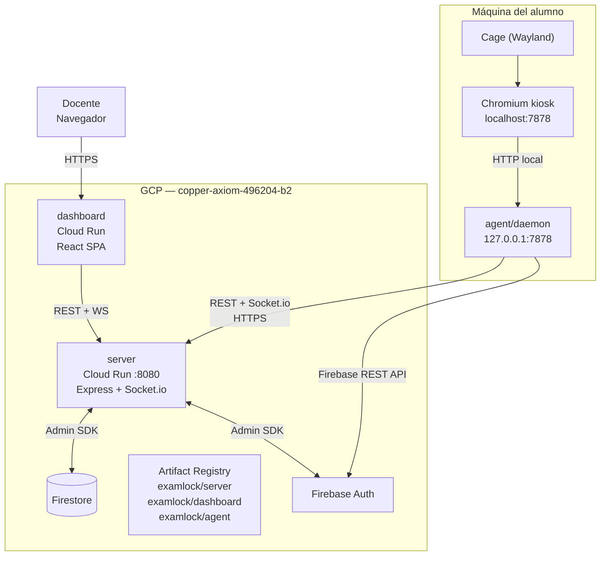
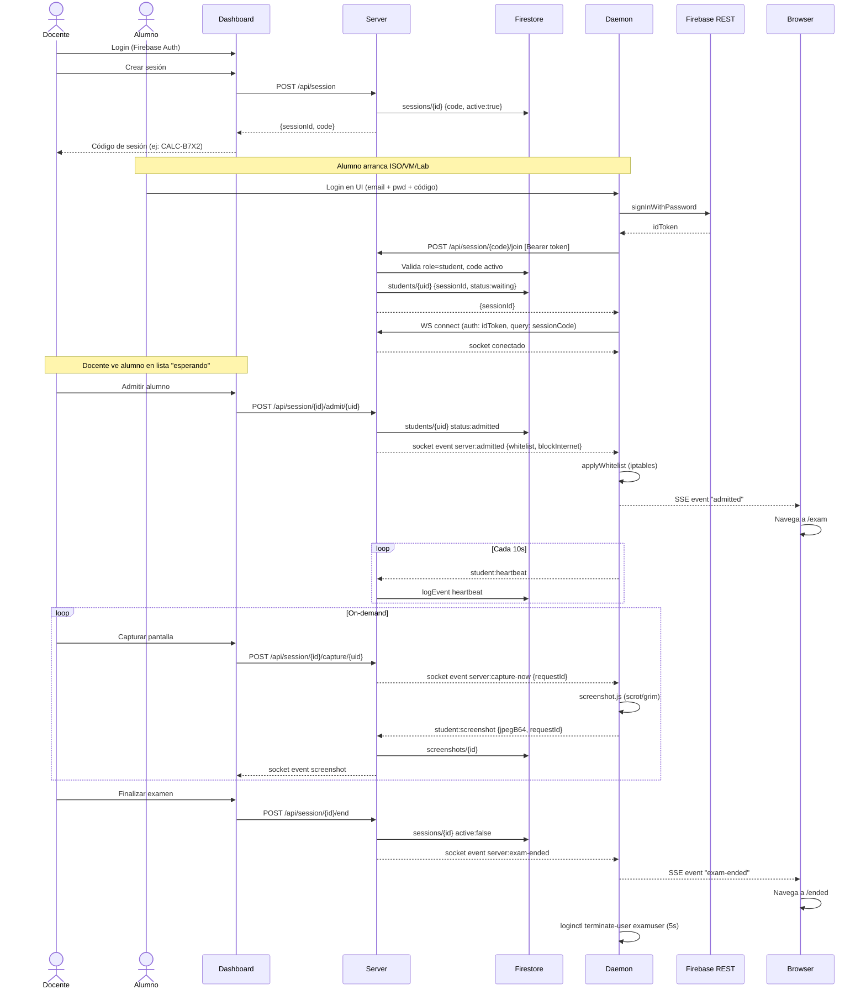
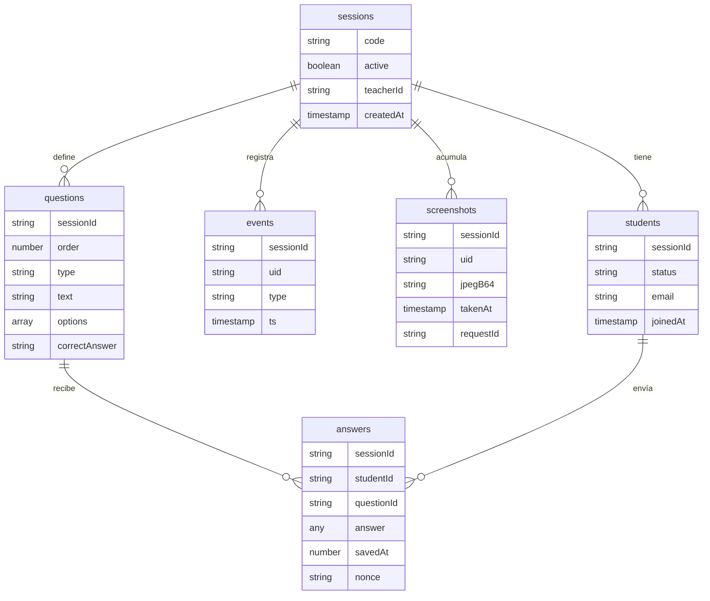
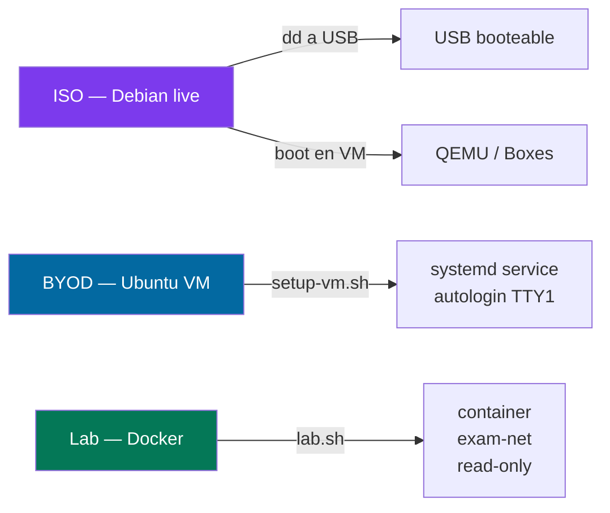
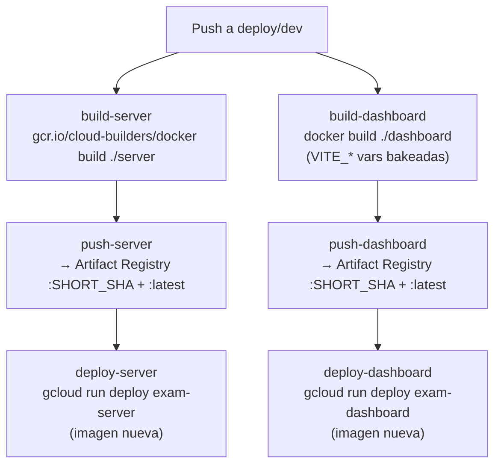
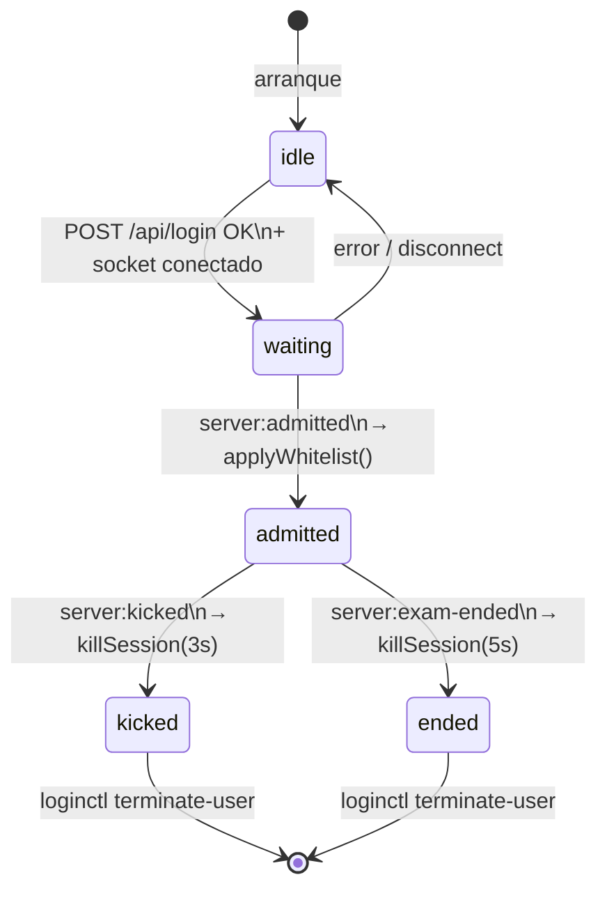

# ExamLock — Arquitectura del sistema

## Componentes

| Componente | Runtime | Dónde corre |
|---|---|---|
| **server** | Node.js + Express + Socket.io | Cloud Run |
| **dashboard** | React + Vite (SPA) | Cloud Run |
| **agent/daemon** | Node.js + Express | Máquina del alumno (ISO / BYOD / Lab) |
| **Firestore** | Firebase | GCP (mismo proyecto) |
| **Artifact Registry** | Docker | GCP |

---

## Diagrama general

---

## Flujo de sesión de examen

---

## Firestore — Colecciones

**Colecciones activas:**
- `sessions`, `students`, `events`, `screenshots` — en producción
- `questions`, `answers` — implementadas en `server/src/routes/exams.js` + `agent/answers.js`, montadas en `/api/exam`

---

## Modos de despliegue del agente

### ISO (kiosk dedicado)
- Debian bookworm live, construido con `live-build` dentro de Docker
- Agente bakeado en `/opt/examlock/`, arranca como servicio systemd
- Cage (Wayland) + Chromium kiosk apuntando a `localhost:7878`
- `examuser` sin contraseña, autologin

### BYOD (VM del alumno)
- Ubuntu 22.04 importada como `.ova` en VirtualBox
- `setup-vm.sh` instala deps, configura autologin, registra `examlock.service`
- Mismo flujo que ISO una vez arrancada

### Lab (Linux existente)
- `launcher/lab.sh <SESSION_CODE>` lanza container Docker
- Red `exam-net` bridge aislada, `--cap-drop ALL`, filesystem read-only
- Cage + Chromium en kiosk sobre el escritorio existente

---

## CI/CD — Cloud Build

Variables de sustitución configuradas en el trigger de Cloud Build (no en YAML):
- `_SERVER_URL` — URL del Cloud Run del server
- `_VITE_FIREBASE_*` — credenciales Firebase para el dashboard

---

## Agent interno — Máquina de estados

---

## Puertos y comunicación

| Origen | Destino | Puerto | Protocolo |
|---|---|---|---|
| Chromium (kiosk) | agent/daemon | 7878 (loopback) | HTTP |
| agent/daemon | server (Cloud Run) | 443 | HTTPS + WSS |
| agent/daemon | Firebase Auth REST | 443 | HTTPS |
| Dashboard (browser) | server (Cloud Run) | 443 | HTTPS + WSS |
| Dashboard (browser) | Firebase Auth | 443 | HTTPS |
| Cloud Build | Artifact Registry | 443 | HTTPS |
| Cloud Build | Cloud Run | 443 | HTTPS (gcloud) |
