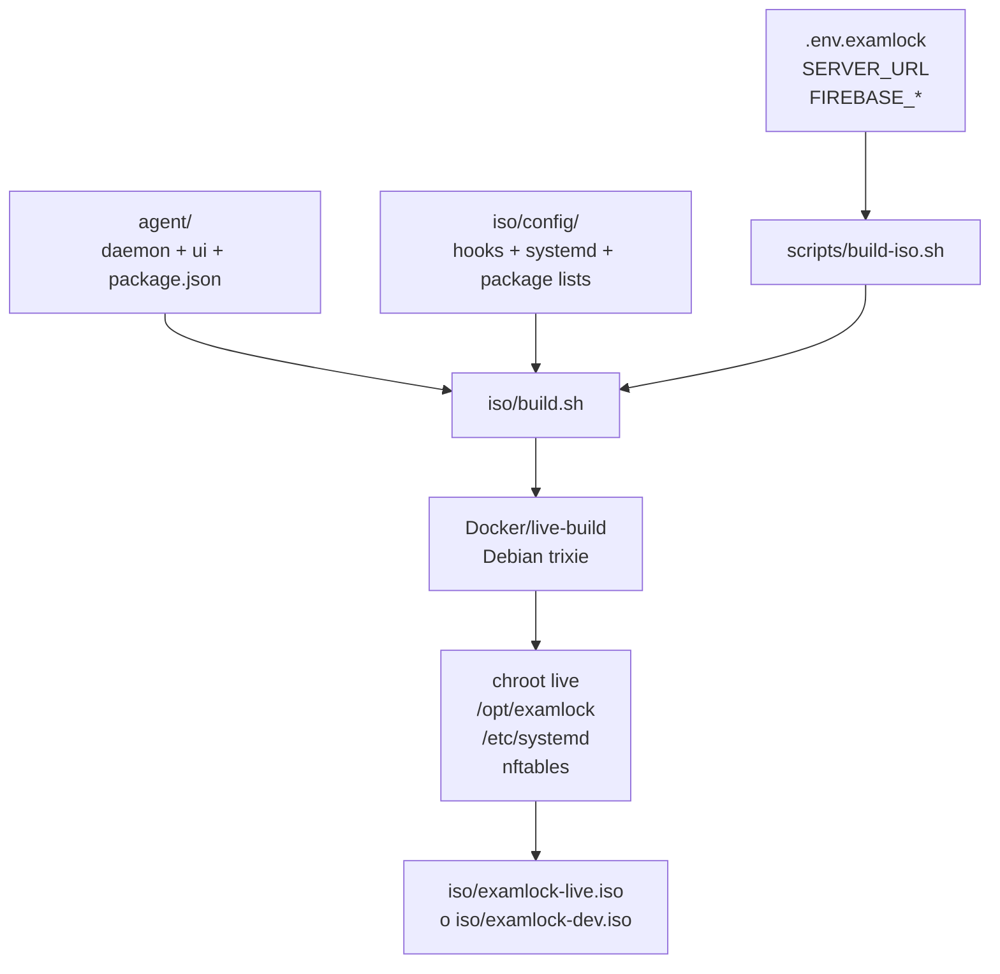
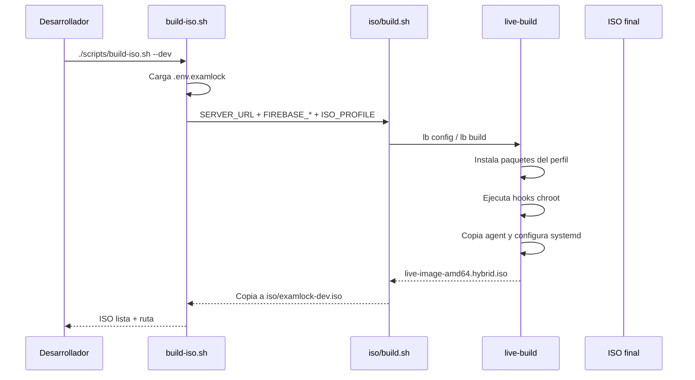
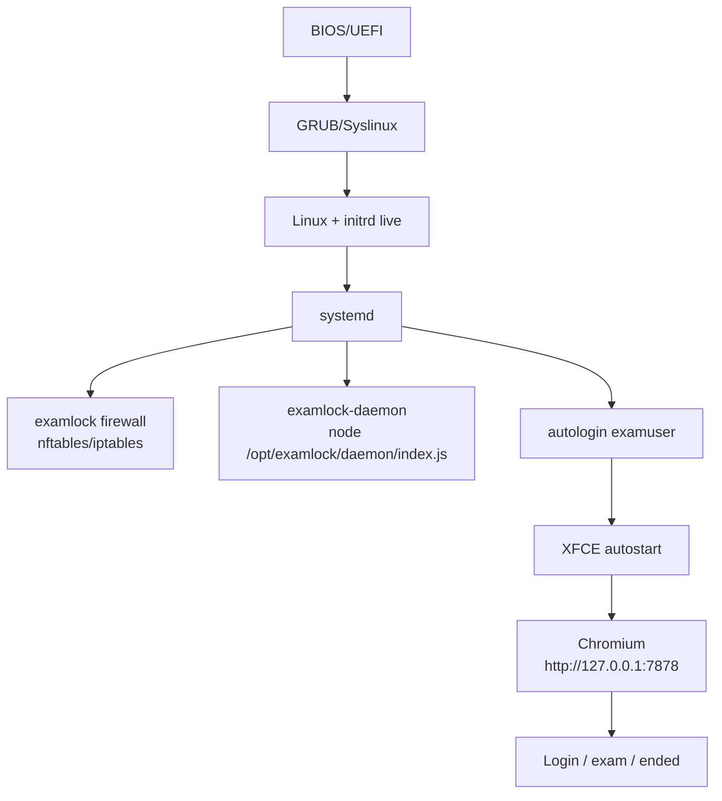

# Compilación de la ISO

## Qué se compila

La ISO toma una base Debian Live, instala paquetes del perfil elegido, copia el agent, escribe variables de entorno y deja systemd configurado para arrancar directo al kiosk.



## Requisitos

- Docker o entorno compatible para `live-build`.
- Espacio libre suficiente. El directorio `iso/build` puede crecer varios GB.
- Archivo `.env.examlock` en la raíz.

Crear variables locales:

```bash
cp .env.examlock.example .env.examlock
```

Variables requeridas:

```bash
SERVER_URL=https://tu-servidor.com
FIREBASE_API_KEY=...
FIREBASE_AUTH_DOMAIN=....firebaseapp.com
FIREBASE_PROJECT_ID=...
```

## Builds disponibles

```bash
./scripts/build-iso.sh
```

Construye la ISO full en `iso/examlock-live.iso`.

```bash
./scripts/build-iso.sh --dev
```

Construye la ISO liviana de desarrollo en `iso/examlock-dev.iso`.

```bash
./scripts/build-iso.sh --clean
```

Borra `iso/build` antes de compilar.

```bash
./scripts/build-iso.sh --watch
```

Compila y luego arranca la VM con hot reload.

## Flujo de build



## Perfiles

| Perfil | Salida | Uso |
|---|---|---|
| `full` | `iso/examlock-live.iso` | Imagen final para USB/lab real. |
| `dev` | `iso/examlock-dev.iso` | Imagen rápida para QEMU/desarrollo. |

Los perfiles usan listas en `iso/package-lists/`:

- `examlock-full.list.chroot`
- `examlock-dev.list.chroot`

Ambos perfiles incluyen un kit mínimo para exámenes de programación:

- Python 3 con alias `python`, `pip`, `venv`, `pytest`, `requests`, `flask` e IDLE.
- Node.js 20, instalado por el hook `9000-examlock.hook.chroot`.
- SQLite por consola y DB Browser for SQLite.
- Geany, Nano, Git, `build-essential` y utilidades como `jq`, `ripgrep`, `tree`, `zip` y `unzip`.

## Boot de la ISO



## Probar en VM

```bash
./scripts/dev-vm.sh --dev
```

Comandos útiles con la VM encendida:

```bash
./scripts/dev-vm.sh --logs
./scripts/dev-vm.sh --shell
./scripts/dev-vm.sh --push
```

## Grabar USB

Revisa bien el dispositivo antes de ejecutar. `dd` borra el destino.

```bash
sudo dd if=iso/examlock-live.iso of=/dev/sdX bs=4M status=progress oflag=sync
sync
```

También sirve una herramienta gráfica como balenaEtcher.

## Artefactos generados

| Ruta | Se puede regenerar | Comentario |
|---|---:|---|
| `iso/build/` | Sí | Cache y salida intermedia de live-build. |
| `iso/build.log` | Sí | Log del build más reciente. |
| `iso/examlock-dev.iso` | Sí | ISO dev. |
| `iso/examlock-live.iso` | Sí | ISO full. |
