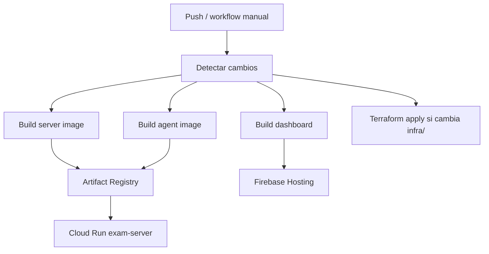

# Deploy

La guía mantenida de infraestructura y despliegue está en [infrastructure.md](./infrastructure.md).

Resumen:



Comandos locales relevantes:

```bash
cd infra
terraform init
terraform apply -var="jwt_secret=$(openssl rand -hex 32)"
```

Deploy manual:

1. GitHub Actions.
2. `Deploy ExamLock`.
3. `Run workflow`.
4. Usar `force_infra` o `force_dashboard` solo cuando quieras forzar esas etapas.
