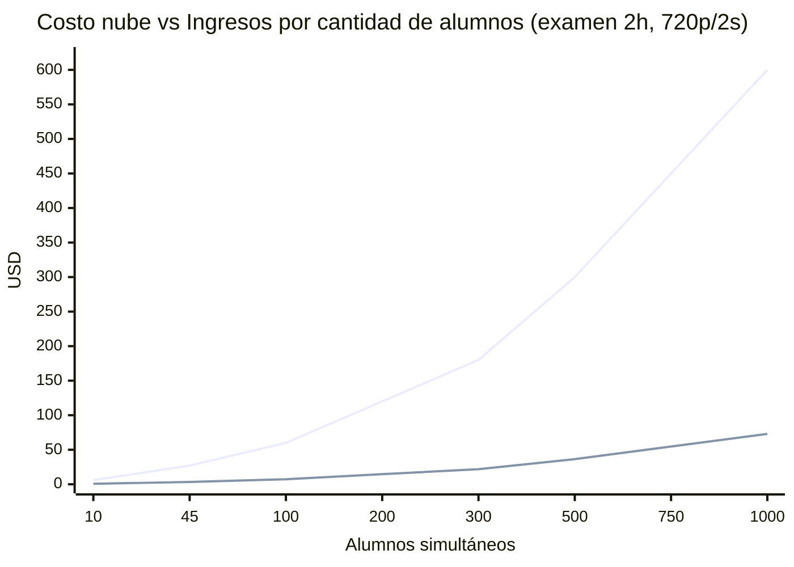

# Simulación de Costos GCP — Escenarios de Examen

**Fecha:** Mayo 2026  
**Stack:** Firebase Auth · Firestore Native · Cloud Run · GCS · Socket.IO + JPEG base64 · 1 docente en dashboard.

---

## Proyección de escala — Costo vs Ingresos (examen 2 horas)

> Costo variable: ~$0,073/alumno. Ingreso a $0,30/alumno-hora = $0,60/alumno en 2h. Margen estable ~88%.

```mermaid
xychart-beta
    title "Desglose de costo por componente (examen 2h, 720p/2s)"
    x-axis "Alumnos simultáneos" [10, 45, 100, 200, 300, 500, 750, 1000]
    y-axis "USD" 0 --> 80
    bar "Egress (domina)" [0.63, 2.83, 6.30, 12.60, 18.90, 31.50, 47.25, 63.00]
    bar "Cloud Run CPU" [0.09, 0.39, 0.86, 1.73, 2.59, 4.32, 6.48, 8.64]
    bar "Firestore + GCS" [0.01, 0.06, 0.14, 0.27, 0.41, 0.60, 1.02, 1.36]
```





> **Lectura clave:** el egress representa ~86% del costo total en todos los niveles de escala. Cloud Run CPU es el segundo componente (~12%). Firestore y GCS son ruido (<2%).

---

## Escenario A — 45 alumnos, 2 horas

**Escenario:** Examen supervisado en vivo, resolución 720p, intervalo 2s (default), 1 docente en dashboard.

---

## Parámetros base

| Parámetro | Valor | Fuente en código |
|---|---|---|
| Alumnos simultáneos | 45 | — |
| Duración examen | 2 horas = 7.200 s | — |
| Resolución stream | 720p (1280×720) | `server/src/monitoringConfig.js` |
| Calidad JPEG | 70 | `agent/daemon/screenshot.js:26` |
| Intervalo captura | 2.000 ms | `monitoringConfig.js`, default |
| Frecuencia efectiva | 0,5 fps | 1 frame cada 2s |
| Transporte | Socket.IO JSON + base64 | `agent/daemon/index.js:296` |
| Overhead base64 | +33% | Encoding binario → string |
| Heartbeat agent | cada 15s | `agent/daemon/index.js:21` |
| Docentes en dashboard | 1 | — |

---

## 1. Egress (ancho de banda saliente)

> El servidor recibe frames del alumno (ingress, gratis) y los reenvía al docente (egress, pago).

### 1a. Tamaño por frame

```
JPEG 720p q70 raw:          ~115 KB  (promedio de rango 80–150 KB)
Overhead base64 (+33%):      +38 KB
─────────────────────────────────────
Tamaño por frame en tráfico: ~153 KB
```

### 1b. Throughput por alumno

```
0,5 fps × 153 KB/frame = 76,5 KB/s por alumno
76,5 KB/s × 3.600 s/h = 275.400 KB/h ≈ 269 MB/hora
269 MB/hora × 2 horas  = 538 MB = 0,525 GB por alumno (examen completo)
```

### 1c. Egress total del examen

```
45 alumnos × 0,525 GB/alumno = 23,6 GB de egress total
```

### 1d. Costo egress

```
Precio GCP Premium Tier (0–1 TB): $0,12/GB
23,6 GB × $0,12 = $2,83
```

---

## 2. Cloud Run — cómputo (exam-server)

> Cloud Run cobra vCPU-segundo y GiB-segundo solo mientras hay requests activos.  
> Socket.IO mantiene conexión abierta → factura por toda la duración.

### 2a. CPU por alumno

El server parsea JSON con base64 + emite a docente por cada frame → CPU no trivial.

```
Estimado: 0,05 vCPU por alumno simultáneo
45 alumnos × 0,05 vCPU = 2,25 vCPU sostenidos
```

### 2b. Memoria por alumno

```
Estimado: 50 MiB por conexión Socket.IO activa (buffers base64)
45 alumnos × 50 MiB = 2.250 MiB = 2,20 GiB sostenidos
```

### 2c. Costo CPU

```
Precio: $0,000024/vCPU-segundo
2,25 vCPU × 7.200 s × $0,000024 = $0,389
Free tier mensual: 180.000 vCPU-s gratuitos
→ 2,25 × 7.200 = 16.200 vCPU-s utilizados (dentro del free tier)
Costo efectivo: $0,00  ← primer examen del mes
Costo sin free tier: $0,39
```

> **Nota:** El free tier cubre ~11 exámenes de este tamaño por mes. A partir del examen 12, se paga.

### 2d. Costo memoria

```
Precio: $0,0000025/GiB-segundo
2,20 GiB × 7.200 s × $0,0000025 = $0,040
Free tier mensual: 360.000 GiB-s gratuitos
→ 2,20 × 7.200 = 15.840 GiB-s utilizados (dentro del free tier)
Costo efectivo: $0,00  ← primer examen del mes
Costo sin free tier: $0,04
```

### 2e. Requests (Socket.IO frames)

```
45 alumnos × (7.200 s / 2 s/frame) = 162.000 frames/examen
Free tier: 2.000.000 requests/mes → 162.000 cubiertos
Costo efectivo: $0,00
```

### 2f. exam-dashboard (nginx estático)

```
Sirve el build de React una vez al docente → despreciable.
Estimado: $0,01
```

### Subtotal Cloud Run

```
Con free tier:   $0,01
Sin free tier:   $0,44
```

---

## 3. Firestore — lecturas y escrituras

### 3a. Escrituras (writes) — $0,18 por 100.000

| Evento | Frecuencia | Total |
|---|---|---|
| Heartbeat del agente (cada 15s) | 45 × (7.200/15) = 45 × 480 | 21.600 |
| Eventos de sesión (login, start, end, flag, etc.) | ~15 eventos × 45 | 675 |
| Updates de estado alumno (active/idle/disconnected) | ~5 por alumno | 225 |
| Screenshots on-demand (metadata URL) | ~5 capturas por alumno | 225 |
| **Total writes** | | **22.725** |

```
Free tier diario: 20.000 writes/día
Writes sobre free tier: 22.725 − 20.000 = 2.725 writes facturables
2.725 / 100.000 × $0,18 = $0,005
```

### 3b. Lecturas (reads) — $0,06 por 100.000

| Evento | Total |
|---|---|
| Listeners realtime docente (1 listener × 21.600 cambios de heartbeat) | 21.600 |
| Carga inicial sesión + config + lista alumnos | ~200 |
| **Total reads** | **~21.800** |

```
Free tier diario: 50.000 reads/día → 21.800 cubiertos
Costo efectivo: $0,00
```

### Subtotal Firestore

```
$0,005 ≈ $0,01
```

---

## 4. Google Cloud Storage — capturas on-demand

> El stream en vivo NO se guarda en GCS. Solo las capturas que el docente pide manualmente.

```
Capturas on-demand estimadas:  5 por alumno × 45 = 225 fotos
Tamaño por captura:            ~100 KB (JPEG q70, sin base64)
Total almacenado:              225 × 100 KB = 22,5 MB = 0,022 GB
```

### 4a. Almacenamiento (multi-region US actual: $0,026/GB-mes)

```
0,022 GB × $0,026 = $0,0006  ← centésimas de centavo
```

### 4b. Operaciones Class A (uploads)

```
225 uploads × $0,01/1.000 = $0,002
```

### 4c. Egress GCS → client (docente descarga foto)

```
225 fotos × 100 KB = 22,5 MB = 0,022 GB
0,022 GB × $0,12 = $0,003
```

### Subtotal GCS

```
$0,006 ≈ $0,01
```

---

## 5. Firebase Auth

```
45 alumnos + 1 docente = 46 MAU
Free tier: 50.000 MAU/mes
Costo: $0,00
```

---

## Resumen del examen

### Desglose por ítem

| Componente | Costo (con free tier) | Costo (sin free tier) |
|---|---|---|
| **Egress (stream 45 alumnos × 2h)** | **$2,83** | **$2,83** |
| Cloud Run cómputo (CPU + RAM) | $0,01 (dashboard) | $0,44 |
| Firestore (writes sobre free tier) | $0,01 | $0,04 |
| GCS (capturas on-demand) | $0,01 | $0,01 |
| Firebase Auth | $0,00 | $0,00 |
| **TOTAL** | **$2,86** | **$3,32** |

### Por alumno

```
Con free tier:   $2,86 / 45 = $0,064 por alumno (examen 2h)  = $0,032/alumno-hora
Sin free tier:   $3,32 / 45 = $0,074 por alumno (examen 2h)  = $0,037/alumno-hora
```

---

## Ingresos vs costos al precio sugerido

| Precio venta | Ingresos brutos | Costo nube | Margen bruto | % margen |
|---|---|---|---|---|
| $0,20/alumno-hora | $18,00 | $3,32 | $14,68 | **81%** |
| $0,30/alumno-hora | $27,00 | $3,32 | $23,68 | **88%** |
| $0,35/alumno-hora | $31,50 | $3,32 | $28,18 | **89%** |

> Cálculo base: 45 alumnos × 2 horas × precio unitario.

---

## Sensibilidad de egress por resolución e intervalo

La variable más sensible al precio es el egress. Tabla comparativa:

| Resolución | Intervalo | KB/frame (est.) | MB/alumno-hora | Egress 45 al × 2h | Costo egress |
|---|---|---|---|---|---|
| 480p q70 | 2s | ~55 KB base64 | ~99 MB | ~8,9 GB | $1,07 |
| **720p q70** | **2s** | **~153 KB base64** | **~269 MB** | **~23,6 GB** | **$2,83** |
| 720p q70 | 1s | ~153 KB base64 | ~537 MB | ~47,1 GB | $5,65 |
| 1080p q70 | 2s | ~300 KB base64 | ~530 MB | ~46,8 GB | $5,62 |

> **Configuración óptima precio/calidad:** 720p + 2s (default actual). Bajar a 480p reduce egress 62%.

---

## Optimizaciones para reducir costo ~30%

| Acción | Ahorro estimado | Dificultad |
|---|---|---|
| Enviar frames como **Buffer binario** en Socket.IO (no base64) | −25% egress → **−$0,71** | Media |
| GCS bucket en **regional** en vez de multi-region | −23% storage (mínimo impacto en este escenario) | Baja |
| Comprimir frames con **WebP q70** en vez de JPEG | −15-20% tamaño | Media |
| Ofrecer modo **480p** al docente en exámenes grandes | −62% egress → **−$1,76** | Baja |

---

## Notas de escalabilidad (Escenario A)

- **Cloud Run `maxScale=2` actual** (`infra/main.tf:163`) soporta ~90 conexiones. Para 45 alumnos está al límite. Subir a `maxScale=5` antes de producción.
- Si hay **más de 1 docente** mirando el mismo examen simultáneamente, el egress se multiplica por la cantidad de docentes.
- A partir del **examen 12 del mes** (≈ ~200 alumnos-hora acumulados) el free tier de Cloud Run se agota y el cómputo empieza a facturar ($0,44 por examen adicional de este tamaño).

---

---

## Escenario B — 500 alumnos, 2 horas

**Escenario:** Mismos parámetros técnicos. 500 alumnos simultáneos, 720p/2s, 1 docente en dashboard.  
Este escenario **requiere cambios en la infra actual** — se detalla en la Sección 2.

---

## Sección 1 — Costos operativos GCP

### B.1. Egress (ancho de banda saliente)

```
Throughput por alumno (igual que Escenario A):
  0,5 fps × 153 KB/frame = 76,5 KB/s
  76,5 KB/s × 3.600 s/h  = 269 MB/hora
  269 MB/hora × 2 horas  = 538 MB = 0,525 GB por alumno

Egress total del examen:
  500 alumnos × 0,525 GB = 262,5 GB
```

**Tramo de precio:** 262,5 GB está dentro del primer tramo (0–1 TB) → $0,12/GB.

```
262,5 GB × $0,12 = $31,50
```

### B.2. Cloud Run — cómputo (exam-server)

```
CPU sostenida:
  500 alumnos × 0,05 vCPU  = 25 vCPU
  25 vCPU × 7.200 s        = 180.000 vCPU-segundos

Free tier mensual: 180.000 vCPU-s  ← este examen consume el free tier COMPLETO
VCPU-s facturables: 180.000 (todo factura si es el primer examen grande del mes)
180.000 × $0,000024 = $4,32
```

> Si ya se corrió el Escenario A antes en el mismo mes, el free tier ya está parcialmente consumido.

```
Memoria sostenida:
  500 alumnos × 50 MiB     = 25.000 MiB = 24,4 GiB
  24,4 GiB × 7.200 s       = 175.680 GiB-segundos

Free tier mensual: 360.000 GiB-s → 175.680 cubiertos
GiB-s facturables: $0,00 (dentro de free tier)
```

```
Requests (frames Socket.IO):
  500 alumnos × (7.200 s / 2 s) = 1.800.000 frames
  Free tier: 2.000.000/mes → cubierto por $0,001 (sobre el límite con requests menores)
  Costo: ~$0,00
```

```
exam-dashboard (nginx estático, 1 docente):
  Despreciable → $0,01
```

**Subtotal Cloud Run:**
```
CPU:      $4,32
Memoria:  $0,00
Requests: $0,00
Dashboard $0,01
─────────────────
Total:    $4,33
```

### B.3. Firestore — lecturas y escrituras

#### Escrituras — $0,18 por 100.000

| Evento | Cálculo | Total |
|---|---|---|
| Heartbeat (cada 15s, 500 alumnos) | 500 × (7.200/15) = 500 × 480 | 240.000 |
| Eventos de sesión (~15 por alumno) | 500 × 15 | 7.500 |
| Updates de estado alumno | 500 × 5 | 2.500 |
| Screenshots on-demand (metadata) | 500 × 5 | 2.500 |
| **Total writes** | | **252.500** |

```
Free tier diario:           20.000 writes
Writes facturables:        232.500
232.500 / 100.000 × $0,18 = $0,42
```

#### Lecturas — $0,06 por 100.000

| Evento | Total |
|---|---|
| Listeners realtime (1 por alumno × 480 heartbeats) | 240.000 |
| Carga inicial sesión + config + lista | ~700 |
| **Total reads** | **~240.700** |

```
Free tier diario:          50.000 reads
Reads facturables:        190.700
190.700 / 100.000 × $0,06 = $0,11
```

**Subtotal Firestore:**
```
Writes: $0,42
Reads:  $0,11
─────────────
Total:  $0,53
```

### B.4. Google Cloud Storage — capturas on-demand

```
Capturas estimadas:    5 por alumno × 500 = 2.500 fotos
Tamaño por captura:    ~100 KB
Total almacenado:      2.500 × 100 KB = 250 MB = 0,244 GB
```

```
Almacenamiento (multi-region $0,026/GB-mes):
  0,244 GB × $0,026 = $0,006

Class A ops (uploads):
  2.500 × $0,01/1.000 = $0,025

Egress (docente descarga fotos):
  0,244 GB × $0,12 = $0,029
──────────────────────────────
Subtotal GCS: $0,06
```

### B.5. Firebase Auth

```
500 alumnos + 1 docente = 501 MAU
Free tier: 50.000 MAU/mes
Costo: $0,00
```

---

### Resumen de costos — Escenario B

| Componente | Costo |
|---|---|
| **Egress (stream 500 alumnos × 2h)** | **$31,50** |
| Cloud Run cómputo (CPU) | $4,33 |
| Firestore (writes + reads sobre free tier) | $0,53 |
| GCS (capturas on-demand) | $0,06 |
| Firebase Auth | $0,00 |
| **TOTAL** | **$36,42** |

**Por alumno:**
```
$36,42 / 500 = $0,073 por alumno (examen 2h) = $0,036/alumno-hora
```

### Ingresos vs costos al precio sugerido

| Precio venta | Ingresos brutos | Costo nube | Margen bruto | % margen |
|---|---|---|---|---|
| $0,20/alumno-hora | $200,00 | $36,42 | $163,58 | **82%** |
| $0,30/alumno-hora | $300,00 | $36,42 | $263,58 | **88%** |
| $0,35/alumno-hora | $350,00 | $36,42 | $313,58 | **90%** |

> Cálculo base: 500 alumnos × 2 horas × precio unitario.

---

## Sección 2 — Cambios de infra requeridos

> El código actual **NO soporta 500 alumnos simultáneos sin modificaciones.** Estos son los cuellos de botella identificados en el repo.

### Problema 1 — Cloud Run `maxScale` insuficiente

**Archivo:** `infra/main.tf:163`  
**Valor actual:** `max_instance_count = 2`  
**Problema:** 2 instancias × ~60 WebSockets c/u = 120 conexiones máximo. 500 alumnos excede 4× el límite.

```hcl
# Cambio requerido en infra/main.tf
max_instance_count = 20   # soporta 500 conexiones con margen
```

> Con 20 instancias se distribuyen ~25 alumnos por instancia. CPU y memoria por instancia quedan holgadas.

### Problema 2 — Memoria de instancia insuficiente

**Archivo:** `infra/main.tf` (bloque `resources` del exam-server)  
**Valor actual:** `memory = "512Mi"`  
**Problema:** Socket.IO con 25+ conexiones activas + buffers base64 supera 512 MiB fácilmente bajo carga.

```hcl
# Cambio requerido
memory = "1Gi"   # o 2Gi si se concentran más conexiones por instancia
```

### Problema 3 — Socket.IO sin sticky sessions garantizadas

**Archivo:** `server/src/` (Express + Socket.IO)  
**Problema:** Cloud Run puede distribuir requests a distintas instancias. Socket.IO requiere que el alumno siempre llegue a la misma instancia (sticky session) para mantener el namespace y la sala correcta.

**Solución actual disponible:** Cloud Run tiene sticky sessions por cookie (`--session-affinity` en `gcloud run deploy`).

```hcl
# Agregar en el servicio Cloud Run de infra/main.tf
session_affinity = true
```

Sin esto, el stream puede romperse cuando Cloud Run escala a nuevas instancias mid-exam.

### Problema 4 — Overhead base64 × 500 alumnos

**Archivos:** `agent/daemon/index.js:296`, `server/src/domains/monitoring/socket/studentSocketHandler.js:90`  
**Problema:** A 500 alumnos el server parsea y re-serializa 250 frames/segundo en JSON base64. CPU se vuelve el cuello de botella antes que la red.

**Impacto en costo:** Necesita más vCPU por instancia o más instancias → aumenta la factura de Cloud Run.

**Fix de alto impacto:** Enviar frames como Buffer binario (`socket.emit('frame', buffer)` en vez de JSON con base64). Elimina el overhead de encoding/decoding en el server → −33% CPU + −25% egress.

```js
// agent/daemon/index.js — antes
socket.emit('student:monitor-frame', { frame: base64string, ... })

// después
socket.emit('student:monitor-frame', buffer, metadata)
// server hace pipe directo sin parsear el binario
```

### Problema 5 — Firestore writes a 500 alumnos

**Colección:** `sessions/{id}/students/{uid}` (heartbeats)  
**Problema:** 240.000 writes por examen en 2 horas = ~33 writes/segundo sostenidos. Firestore soporta ~1 write/segundo por documento, pero son documentos distintos (1 por alumno) → no hay contención.  
**Estado:** ✅ No hay problema técnico aquí. El costo ($0,42) es el único impacto.

---

### Resumen de cambios en `infra/main.tf`

| Parámetro | Valor actual | Valor recomendado | Impacto en costo |
|---|---|---|---|
| `max_instance_count` (server) | 2 | **20** | +$4,32 CPU/examen |
| `memory` por instancia | 512Mi | **1Gi** | +$0,04 RAM/examen |
| `session_affinity` | no configurado | **true** | $0 (flag de routing) |
| Frames binarios vs base64 | base64 | **Buffer** | −$7,88 egress/examen |

> **Con frames binarios:** egress baja de $31,50 a ~$23,62 → total $28,54 en vez de $36,42.

---

### Tabla comparativa A vs B

| Métrica | Escenario A (45 al.) | Escenario B (500 al.) | Ratio |
|---|---|---|---|
| Egress total | $2,83 | $31,50 | 11,1× |
| Cloud Run cómputo | $0,44 | $4,33 | 9,8× |
| Firestore | $0,01 | $0,53 | 53× |
| GCS | $0,01 | $0,06 | 6× |
| **Total nube** | **$3,32** | **$36,42** | **11×** |
| Costo/alumno-hora | $0,037 | $0,036 | ~1× |
| Ingresos a $0,30/h | $27,00 | $300,00 | 11,1× |
| Margen bruto | $23,68 (88%) | $263,58 (88%) | Estable |

> El costo por alumno-hora es prácticamente constante. El margen no se degrada al escalar — el modelo es linealmente escalable.
