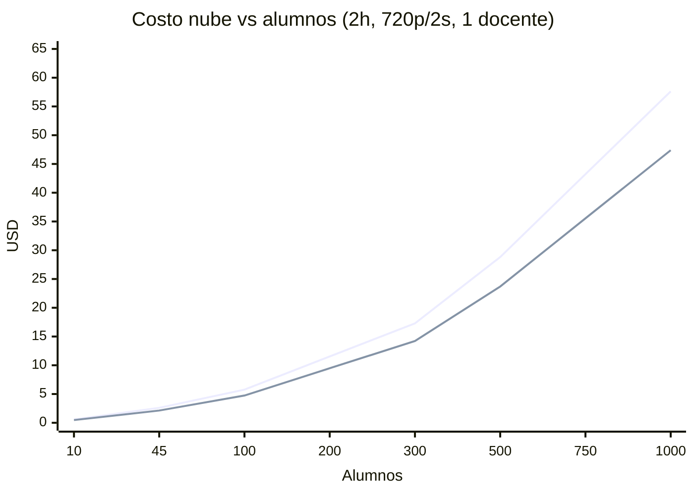

# Simulacion de Costos GCP - ExamLock

**Fecha:** Mayo 2026  
**Stack:** Firebase Auth, Firestore Native, Cloud Run, Cloud Storage, Socket.IO con frames JPEG binarios, 1 docente en dashboard.

Este documento estima el costo operativo de ExamLock por examen y por alumno. El objetivo es separar claramente:

- **Costos fijos mensuales:** infraestructura encendida aunque no haya examenes.
- **Costos variables por alumno:** principalmente egreso de red del stream en vivo.
- **Sensibilidad por egreso:** el costo cambia casi linealmente con resolucion, intervalo de captura, duracion y cantidad de docentes mirando.

> Nota importante: una version anterior del calculo asumia que el stream en vivo viajaba como JPEG base64. El codigo actual envia el stream como `Buffer` binario (`student:monitor-frame`), por lo que no se aplica el overhead base64 de +33% al stream principal. Base64 sigue aplicando a capturas on-demand (`student:screenshot`), pero ese volumen es pequeno.

---

## 1. Supuestos base

### Configuracion tecnica actual

| Item | Valor base | Fuente / comentario |
|---|---:|---|
| Region Cloud Run | `us-central1` | `infra/main.tf` usa `var.region`; el proyecto importa recursos en `us-central1`. |
| Cloud Run server | `exam-server`, `minScale=0`, `maxScale=2`, `1 vCPU`, `512Mi` | `infra/main.tf` |
| Cloud Run dashboard | `exam-dashboard`, `minScale=0`, `maxScale=3`, `1 vCPU`, `256Mi` | `infra/main.tf` |
| Firestore | Native, default DB | `infra/main.tf` |
| GCS screenshots | bucket `US`, retencion 90 dias | `infra/main.tf` |
| Resolucion default stream | 720p, max 1280 x 720 | `server/src/monitoringConfig.js` |
| Intervalo default stream | 2000 ms | `server/src/monitoringConfig.js` |
| Calidad JPEG | 70 | `agent/daemon/index.js` |
| Transporte stream | Socket.IO binario | `agent/daemon/index.js`, `student:monitor-frame` |
| Heartbeat alumno | cada 15 s | `agent/daemon/index.js` |
| Docentes mirando | 1 | Supuesto comercial base |

### Precios usados

Los precios son USD y deben verificarse antes de cotizar formalmente. Para este documento se usan los precios publicos observados en mayo de 2026:

| Servicio | Precio usado | Nota |
|---|---:|---|
| Internet egress Premium Tier NA/Europa | $0.12/GiB | Primer tramo pagado, despues del primer GiB mensual gratis. |
| Cloud Run CPU | $0.000024/vCPU-s | Request-based billing, tier 1. |
| Cloud Run memoria | $0.0000025/GiB-s | Request-based billing, tier 1. |
| Cloud Run requests | $0.40 / 1M requests | En este workload es marginal frente a CPU y red. |
| Firestore reads | $0.03 / 100k reads | Standard edition, region multi-region norteamerica. |
| Firestore writes | $0.09 / 100k writes | Standard edition, region multi-region norteamerica. |
| GCS storage US multi-region | ~$0.026/GiB-mes | Impacto muy bajo para screenshots. |
| GCS egress a cliente | $0.12/GiB | Igual caso base NA/Europa. |
| Firebase Auth email/password | $0 | En este volumen y sin phone auth/Identity Platform avanzado. |

Fuentes oficiales:

- Cloud Run pricing: https://cloud.google.com/run/pricing
- Network pricing: https://cloud.google.com/vpc/network-pricing
- Firestore pricing: https://cloud.google.com/firestore/pricing
- Firebase pricing: https://firebase.google.com/pricing
- Cloud Storage pricing: https://cloud.google.com/storage/pricing

---

## 2. Formula de costo variable por alumno

### Formula de egreso del stream

El servidor recibe frames desde cada alumno y los reenvia al dashboard del docente. El ingreso hacia GCP no se cobra; el egreso desde GCP hacia el docente si se cobra.

```text
frames por segundo = 1000 / intervalo_ms
GiB por alumno = KB_frame * frames_por_segundo * segundos_examen / 1024 / 1024
costo egreso alumno = GiB_por_alumno * precio_egreso_GiB * docentes_mirando
```

Caso base 720p/2s:

```text
Tamano estimado frame JPEG 720p q70: 115 KB
Frecuencia: 0.5 fps
Duracion: 2 h = 7200 s

115 KB * 0.5 * 7200 / 1024 / 1024 = 0.395 GiB/alumno
0.395 GiB * $0.12/GiB = $0.047/alumno por examen de 2h
```

### Formula de Cloud Run por alumno

El stream mantiene WebSocket activo durante el examen. Para una estimacion prudente se modela el costo como recursos sostenidos durante toda la duracion:

```text
CPU estimada por alumno: 0.05 vCPU
Memoria estimada por alumno: 50 MiB = 0.0488 GiB
Duracion: 7200 s

CPU: 0.05 * 7200 * $0.000024 = $0.00864
RAM: 0.0488 * 7200 * $0.0000025 = $0.00088
Cloud Run por alumno 2h sin free tier = $0.00952
```

### Formula de Firestore por alumno

Eventos estimados por alumno en examen de 2h:

| Evento | Cantidad por alumno |
|---|---:|
| Heartbeats cada 15s | 480 writes |
| Eventos de sesion, estado y auditoria | ~20 writes |
| Metadata de capturas on-demand | ~5 writes |
| Lecturas/listeners derivadas | ~480 reads |

```text
Writes: 505 / 100000 * $0.09 = $0.00045
Reads:  480 / 100000 * $0.03 = $0.00014
Firestore por alumno 2h sin free tier = ~$0.00060
```

### Formula de GCS por alumno

Supuesto de capturas on-demand:

```text
5 capturas por alumno
100 KB por captura
500 KB = 0.00048 GiB/alumno
```

El costo por alumno es menor a $0.001 incluso sumando storage, operaciones y descarga de imagenes. En tablas se redondea como componente marginal.

---

## 3. Costo por alumno

Caso base: 1 docente, examen de 2h, egreso NA/Europa a $0.12/GiB.

| Componente | Costo por alumno-examen 2h | Costo por alumno-hora | Comentario |
|---|---:|---:|---|
| Egreso stream 720p/2s | $0.047 | $0.024 | Componente dominante. |
| Cloud Run server | $0.0095 | $0.0048 | Sin contar free tier mensual. |
| Firestore | $0.0006 | $0.0003 | Antes de free tier diario. |
| GCS screenshots | ~$0.0001 | ~$0.0001 | Depende de capturas manuales. |
| Firebase Auth | $0.0000 | $0.0000 | Email/password en este volumen. |
| **Total variable sin free tier** | **~$0.058** | **~$0.029** | Base para margen conservador. |

Con free tiers disponibles, los primeros examenes del mes pueden bajar principalmente por Cloud Run y Firestore. Para pricing comercial conviene usar el costo **sin free tier** como base estable.

---

## 4. Sensibilidad por resolucion e intervalo

Caso: 1 docente, 2 horas, $0.12/GiB, stream binario.

| Modo | KB/frame estimado | Intervalo | GiB/alumno 2h | Egreso/alumno 2h | Total variable/alumno 2h estimado |
|---|---:|---:|---:|---:|---:|
| 480p/5s | 41 KB | 5s | 0.056 GiB | $0.007 | ~$0.017 |
| 480p/2s | 41 KB | 2s | 0.141 GiB | $0.017 | ~$0.027 |
| **720p/2s default** | **115 KB** | **2s** | **0.395 GiB** | **$0.047** | **~$0.058** |
| 720p/1s | 115 KB | 1s | 0.790 GiB | $0.095 | ~$0.105 |
| 1080p/2s | 225 KB | 2s | 0.772 GiB | $0.093 | ~$0.103 |

Lectura:

- Pasar de 720p/2s a 480p/2s reduce el egreso ~64%.
- Pasar de 720p/2s a 720p/1s duplica casi exactamente el costo de egreso.
- 1080p/2s cuesta casi lo mismo que 720p/1s porque ambos duplican aproximadamente los bytes enviados.

---

## 5. Escenarios de examen

Caso: 2 horas, 720p/2s, 1 docente, $0.12/GiB, sin aplicar free tier para mantener una base estable.

| Alumnos | Egreso stream | Cloud Run | Firestore | GCS | Total estimado | Costo/alumno | Costo/alumno-hora |
|---:|---:|---:|---:|---:|---:|---:|---:|
| 10 | $0.47 | $0.10 | $0.01 | $0.00 | **$0.58** | $0.058 | $0.029 |
| 45 | $2.13 | $0.44 | $0.03 | $0.01 | **$2.60** | $0.058 | $0.029 |
| 100 | $4.74 | $0.96 | $0.06 | $0.01 | **$5.77** | $0.058 | $0.029 |
| 200 | $9.48 | $1.91 | $0.12 | $0.02 | **$11.53** | $0.058 | $0.029 |
| 300 | $14.22 | $2.86 | $0.18 | $0.03 | **$17.29** | $0.058 | $0.029 |
| 500 | $23.69 | $4.77 | $0.30 | $0.05 | **$28.81** | $0.058 | $0.029 |
| 750 | $35.54 | $7.15 | $0.45 | $0.08 | **$43.22** | $0.058 | $0.029 |
| 1000 | $47.39 | $9.53 | $0.60 | $0.10 | **$57.62** | $0.058 | $0.029 |



---

## 6. Escenario A - 45 alumnos, 2 horas

### Sin free tier

| Componente | Calculo | Costo |
|---|---:|---:|
| Egreso stream | 45 * 0.395 GiB * $0.12 | $2.13 |
| Cloud Run CPU | 45 * 0.05 vCPU * 7200s * $0.000024 | $0.39 |
| Cloud Run RAM | 45 * 0.0488 GiB * 7200s * $0.0000025 | $0.04 |
| Dashboard estatico | 1 docente | $0.01 |
| Firestore | ~22.7k writes + ~21.6k reads | $0.03 |
| GCS screenshots | 225 capturas aprox. | $0.01 |
| Firebase Auth | 46 MAU | $0.00 |
| **Total** |  | **$2.60** |

### Con free tier disponible

Si es uno de los primeros examenes del mes/dia:

- Cloud Run CPU/RAM puede quedar cubierto por free tier mensual.
- Firestore reads quedan dentro del free tier diario.
- Firestore writes apenas exceden el free tier diario si se superan 20k writes.

| Componente | Costo aproximado con free tier |
|---|---:|
| Egreso stream | $2.13 |
| Cloud Run | $0.01 |
| Firestore | ~$0.00-$0.01 |
| GCS | ~$0.01 |
| Firebase Auth | $0.00 |
| **Total con free tier** | **~$2.15** |

### Ingresos vs costos

| Precio venta | Ingresos brutos | Costo nube sin free tier | Margen bruto | Margen |
|---|---:|---:|---:|---:|
| $0.20/alumno-hora | $18.00 | $2.60 | $15.40 | 86% |
| $0.30/alumno-hora | $27.00 | $2.60 | $24.40 | 90% |
| $0.35/alumno-hora | $31.50 | $2.60 | $28.90 | 92% |

---

## 7. Escenario B - 500 alumnos, 2 horas

Este escenario usa el mismo modelo de costos, pero la infraestructura actual no esta lista para 500 alumnos simultaneos con `maxScale=2`.

### Costos operativos

| Componente | Calculo | Costo sin free tier |
|---|---:|---:|
| Egreso stream | 500 * 0.395 GiB * $0.12 | $23.69 |
| Cloud Run CPU | 500 * 0.05 vCPU * 7200s * $0.000024 | $4.32 |
| Cloud Run RAM | 500 * 0.0488 GiB * 7200s * $0.0000025 | $0.44 |
| Dashboard estatico | 1 docente | $0.01 |
| Firestore | ~252.5k writes + ~240k reads | $0.30 |
| GCS screenshots | 2500 capturas aprox. | $0.05 |
| Firebase Auth | 501 MAU | $0.00 |
| **Total** |  | **$28.81** |

Por alumno:

```text
$28.81 / 500 = $0.058 por alumno en examen de 2h
$0.058 / 2h = $0.029 por alumno-hora
```

### Ingresos vs costos

| Precio venta | Ingresos brutos | Costo nube sin free tier | Margen bruto | Margen |
|---|---:|---:|---:|---:|
| $0.20/alumno-hora | $200.00 | $28.81 | $171.19 | 86% |
| $0.30/alumno-hora | $300.00 | $28.81 | $271.19 | 90% |
| $0.35/alumno-hora | $350.00 | $28.81 | $321.19 | 92% |

### Cambios de infraestructura requeridos

| Area | Estado actual | Recomendacion para 500 alumnos |
|---|---|---|
| Cloud Run `maxScale` server | 2 instancias | Subir a 20 o mas antes de pruebas reales. |
| Memoria server | 512Mi | Subir a 1Gi por instancia para margen de buffers/conexiones. |
| Session affinity | No declarada en Terraform | Activarla si se escala WebSocket en varias instancias. |
| Observabilidad | Basica | Medir CPU, memoria, conexiones, egress y latencia durante carga. |

> El costo calculado asume que la app logra sostener el trafico. Para 500 alumnos no basta con que el costo sea bajo: hay que probar escalabilidad WebSocket y routing antes de produccion.

---

## 8. Sensibilidad por cantidad de docentes

Cada docente que ve el dashboard recibe una copia del stream de cada alumno. Por eso el egreso del stream se multiplica por la cantidad de docentes conectados. Cloud Run y Firestore suben menos que el egreso.

Caso: 500 alumnos, 2h, 720p/2s, $0.12/GiB.

| Docentes mirando | Egreso stream | Otros costos aprox. | Total | Costo/alumno |
|---:|---:|---:|---:|---:|
| 1 | $23.69 | $5.12 | $28.81 | $0.058 |
| 2 | $47.39 | $5.12 | $52.51 | $0.105 |
| 3 | $71.08 | $5.12 | $76.20 | $0.152 |

Recomendacion comercial: cobrar o limitar explicitamente el numero de docentes/monitores concurrentes si el producto permite supervision compartida.

---

## 9. Costos fijos mensuales

Con la infraestructura actual (`minScale=0` en Cloud Run), el costo fijo puro puede ser casi cero si no hay trafico.

| Concepto | Costo fijo mensual estimado | Comentario |
|---|---:|---|
| Cloud Run server | $0.00 | `minScale=0`; cobra cuando atiende trafico. |
| Cloud Run dashboard | $0.00 | `minScale=0`; cobra cuando atiende trafico. |
| Firestore base | $0.00 | Sin uso relevante y dentro de free tier. |
| GCS bucket screenshots | ~$0.00-$1.00 | Depende de retencion y volumen historico; con 90 dias sigue bajo al inicio. |
| Artifact Registry | ~$0.00-$1.00 | Depende del numero/tamano de imagenes almacenadas. |
| Cloud Build | $0.00-$5.00 | Depende de frecuencia de builds; no es costo por alumno. |
| Dominio/DNS | No incluido | Va fuera del costo GCP operativo del examen. |
| **Total fijo esperado** | **~$0-$7/mes** | Si no se activa `minScale>0` ni servicios adicionales. |

Si se decide mantener una instancia caliente para bajar cold starts:

```text
1 instancia server 1 vCPU + 512Mi todo el mes:
CPU: 1 * 2,592,000s * $0.000024 = $62.21/mes
RAM: 0.5 * 2,592,000s * $0.0000025 = $3.24/mes
Total aprox: $65.45/mes antes de free tier
```

Ese cambio convertiria Cloud Run en un costo fijo relevante. Mientras `minScale=0`, no aplica.

---

## 10. Summary final

### Costo base recomendado para cotizacion

Usar como base estable, sin depender de free tiers:

```text
Modo base: 720p/2s, 1 docente, examen de 2h
Egreso por alumno: 0.395 GiB
Costo egreso por alumno: $0.047
Costo Cloud Run por alumno: $0.0095
Firestore + GCS + Auth por alumno: ~$0.001

Costo variable total: ~$0.058/alumno-examen
Costo variable total: ~$0.029/alumno-hora
```

### Fijos + variables

| Tipo | Formula / valor | Costo |
|---|---:|---:|
| Fijo mensual actual | Cloud Run `minScale=0` + serverless dentro de free tier | ~$0-$7/mes |
| Fijo mensual con instancia caliente | 1 instancia 1 vCPU/512Mi siempre activa | ~$65/mes |
| Variable por alumno-hora | 720p/2s, 1 docente | ~$0.029 |
| Variable por alumno-examen | 2h, 720p/2s, 1 docente | ~$0.058 |
| Variable por alumno-semestre | 5 cursos * 4 examenes * 2h | ~$1.16 |
| Variable por docente adicional | suma otro stream completo | +~$0.047/alumno-examen |

### Costo semestral por alumno para universidad

Supuesto academico:

```text
5 cursos por alumno por semestre
4 examenes por curso
2 horas por examen
1 docente mirando
Modo default 720p/2s
```

Calculo:

```text
examenes por alumno-semestre = 5 cursos * 4 examenes = 20 examenes
horas supervisadas por alumno-semestre = 20 examenes * 2h = 40 alumno-horas

costo por alumno-semestre = 20 examenes * $0.058 = $1.16
costo por alumno-semestre = 40 alumno-horas * $0.029 = $1.16
```

Tabla rapida:

| Alumnos activos por semestre | Alumno-examenes | Alumno-horas supervisadas | Costo variable semestre |
|---:|---:|---:|---:|
| 100 | 2,000 | 4,000 | ~$116 |
| 500 | 10,000 | 20,000 | ~$580 |
| 1,000 | 20,000 | 40,000 | ~$1,160 |
| 5,000 | 100,000 | 200,000 | ~$5,800 |

> Esta tabla no prorratea costos fijos. Con `minScale=0`, el fijo mensual esperado es bajo; si se activa una instancia caliente, hay que sumar el fijo mensual correspondiente al semestre.

### Formula comercial rapida

```text
costo_examen =
  costo_fijo_prorrateado
  + alumnos * horas * costo_variable_alumno_hora
  + alumnos * horas * costo_egreso_alumno_hora * (docentes_mirando - 1)
```

Con los valores base:

```text
costo_examen ~= fijo_prorrateado + alumnos * horas * $0.029

Si hay mas de 1 docente:
costo_examen ~= fijo_prorrateado + alumnos * horas * ($0.029 + $0.024 * (docentes - 1))
```

### Lectura ejecutiva

- El producto tiene un costo cloud bajo por alumno: **~$0.058 por examen de 2h** en el modo default.
- El egreso del stream representa aproximadamente **82% del costo variable directo**.
- Los costos fijos son practicamente cero mientras Cloud Run siga con `minScale=0`.
- La rentabilidad a `$0.30/alumno-hora` es alta: un examen de 500 alumnos por 2h genera `$300` brutos contra `~$29` de nube.
- El principal riesgo no es costo, sino capacidad tecnica: para cientos de alumnos hay que subir `maxScale`, considerar session affinity y hacer prueba de carga WebSocket.
