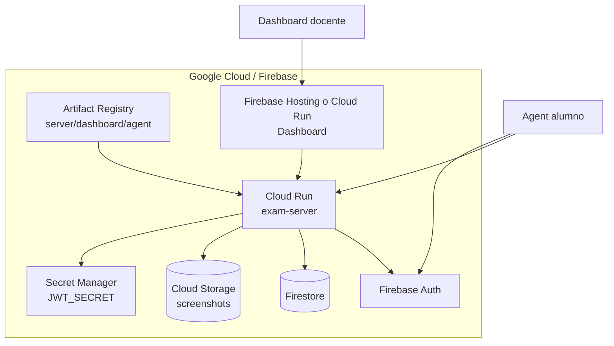
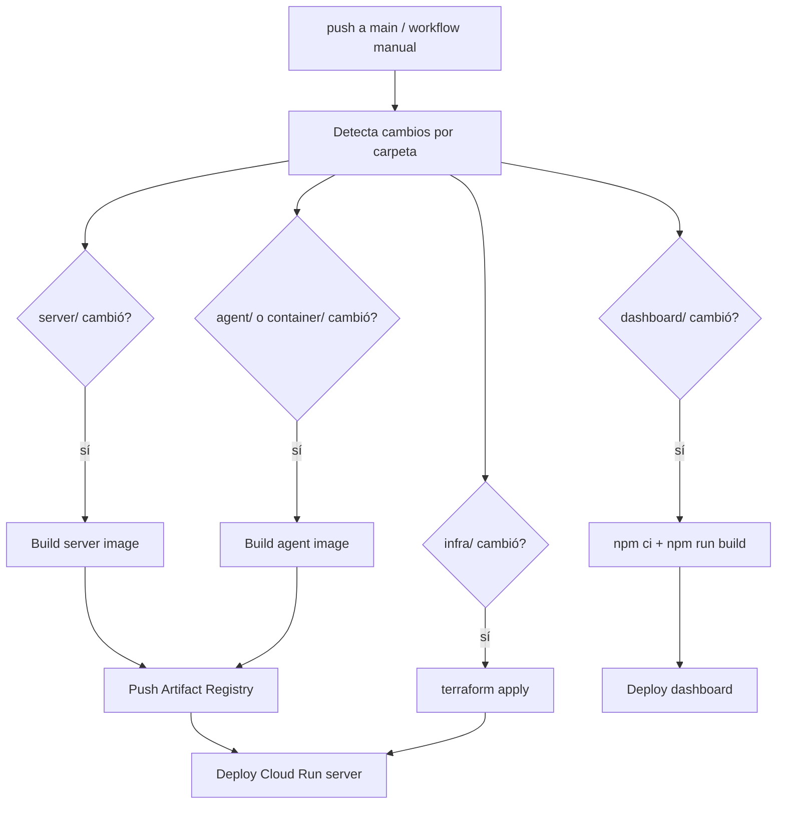

# Infraestructura

## Componentes GCP



## Terraform

La infraestructura vive en `infra/`.

| Archivo | Uso |
|---|---|
| `infra/bootstrap.sh` | Crea/prepara bucket de estado remoto. |
| `infra/backend.tf` | Backend Terraform. |
| `infra/main.tf` | Recursos principales. |
| `infra/variables.tf` | Variables de entrada. |
| `infra/outputs.tf` | Outputs para CI/CD. |
| `infra/terraform.tfvars.example` | Plantilla local. |

Primer setup:

```bash
bash infra/bootstrap.sh <gcp-project-id>
cd infra
cp terraform.tfvars.example terraform.tfvars
gcloud auth application-default login
terraform init
terraform apply -var="jwt_secret=$(openssl rand -hex 32)"
```

Si Firestore ya existe:

```bash
terraform import google_firestore_database.default \
  "projects/<gcp-project-id>/databases/(default)"
```

## CI/CD

El workflow principal está en `.github/workflows/deploy.yml`.



## Secrets de GitHub Actions

| Secret | Uso |
|---|---|
| `WIF_PROVIDER` | Workload Identity Federation provider. |
| `WIF_SA_EMAIL` | Service account usado por GitHub Actions. |
| `JWT_SECRET` | Firma tokens internos/container. |
| `VITE_FIREBASE_API_KEY` | Firebase web config para dashboard. |
| `VITE_FIREBASE_MESSAGING_SENDER_ID` | Firebase web config para dashboard. |
| `VITE_FIREBASE_APP_ID` | Firebase web config para dashboard. |

El service account de CI necesita permisos para Artifact Registry, Cloud Run, Terraform-managed resources y Firebase Hosting si se despliega ahí.

## Deploy manual

Desde GitHub:

1. Actions.
2. Deploy ExamLock.
3. Run workflow.
4. Marcar `force_infra` si quieres forzar Terraform.
5. Marcar `force_dashboard` si quieres forzar dashboard.

## Deploy local del server

```bash
cd server
cp .env.example .env
npm install
npm start
```

Variables relevantes:

```bash
PORT=8080
JWT_SECRET=...
GCP_PROJECT_ID=...
GCS_BUCKET=...
FIRESTORE_DATABASE=(default)
CORS_ORIGINS=http://localhost:5173,https://tu-dashboard
```

## Dashboard

```bash
cd dashboard
cp .env.example .env
npm install
npm run dev
```

Variables Vite/Firebase se hornean durante build, por eso el workflow las pasa antes de `npm run build`.

## Actualizar `JWT_SECRET`

```bash
cd infra
terraform apply -var="jwt_secret=NUEVO_SECRET"
```

Cloud Run usará el secreto actualizado en una nueva revisión o cold start, según cómo esté referenciado.

## Reglas Firebase/Firestore

Hay reglas tanto en raíz como dentro de `server/`:

- `firestore.rules`
- `firestore.indexes.json`
- `firebase.json`
- `server/firestore.rules`
- `server/firestore.indexes.json`
- `server/firebase.json`

La regla de diseño es que escrituras sensibles pasan por server/Admin SDK. El cliente no debe escribir directamente colecciones de auditoría/capturas.
