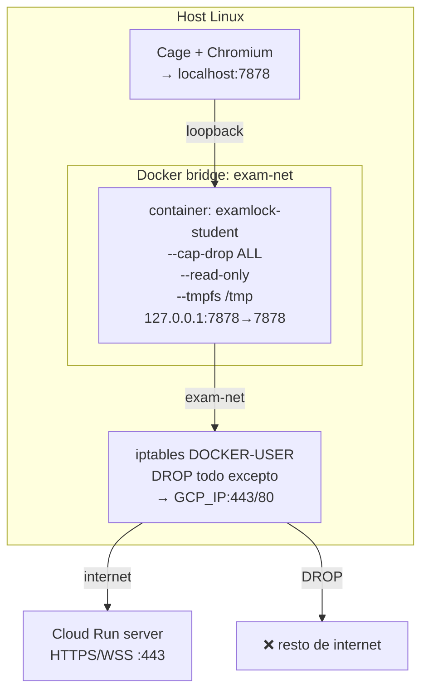

# Red — Aislamiento y reglas

## Diagrama de red (modo Lab/BYOD)



---

# Red Docker — Aislamiento y reglas

## Creación de la red

```bash
docker network create \
  --driver bridge \
  --opt com.docker.network.bridge.enable_icc=false \
  exam-net
```

`enable_icc=false` deshabilita comunicación inter-container en la misma red.

## Restricción de salida (iptables)

El launcher aplica automáticamente la red `exam-net`. Docker crea la interfaz `br-exam-net`.

Para limitar salida solo al servidor GCP, el técnico puede aplicar (como root):

```bash
# Obtener IP del servidor GCP
GCP_IP=$(dig +short exam-server-xxxx-uc.a.run.app | tail -1)

# Interfaz bridge de exam-net (puede variar)
BR_IF=$(docker network inspect exam-net --format '{{.Id}}' | head -c 12)
BR_IF="br-$BR_IF"

# Eliminar regla FORWARD permisiva por defecto de Docker
iptables -D DOCKER-USER -i "$BR_IF" -j RETURN 2>/dev/null || true

# Solo permite salida hacia el servidor GCP (puerto 443)
iptables -I DOCKER-USER -i "$BR_IF" -d "$GCP_IP" -p tcp --dport 443 -j ACCEPT
iptables -I DOCKER-USER -i "$BR_IF" -d "$GCP_IP" -p tcp --dport 80  -j ACCEPT

# Bloquea todo lo demás saliendo de exam-net
iptables -A DOCKER-USER -i "$BR_IF" -j DROP
```

> Nota: Cloud Run resuelve a múltiples IPs y puede cambiarlas. Para producción real,
> considera usar un VPC egress con IP fija o Cloud NAT con allowlist.

## Flags del container

| Flag | Efecto |
|------|--------|
| `--cap-drop ALL` | Sin capabilities de Linux (no puede crear sockets raw, no puede modificar iptables, etc.) |
| `--security-opt no-new-privileges` | El proceso no puede ganar privilegios con setuid |
| `--read-only` | Filesystem root de solo lectura |
| `--tmpfs /tmp` | Único directorio escribible, en RAM, se borra al apagar |
| `-p 127.0.0.1:7878:7878` | Puerto solo expuesto en loopback del host, no en red externa |
| `--network exam-net` | Aislado en bridge dedicado |
