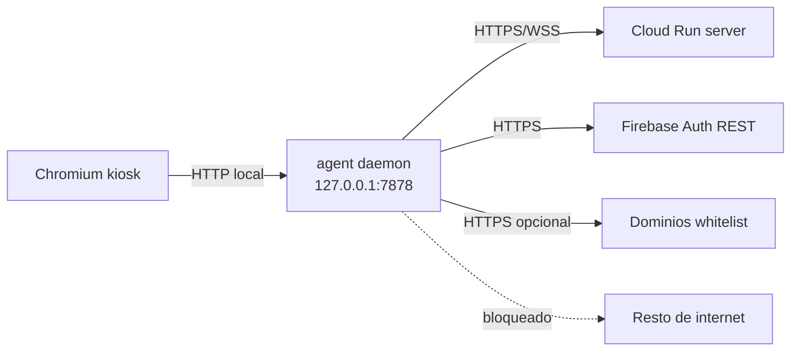
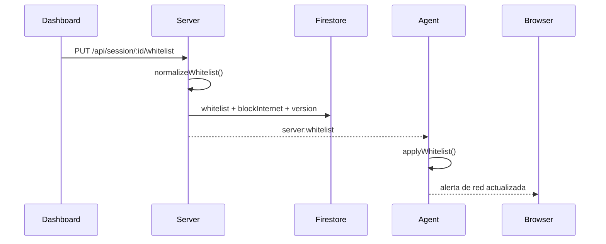
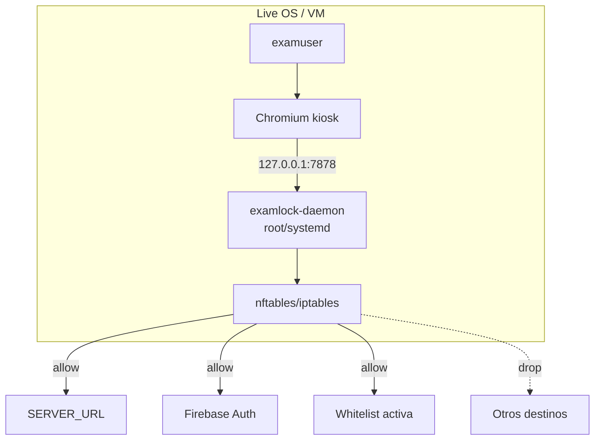
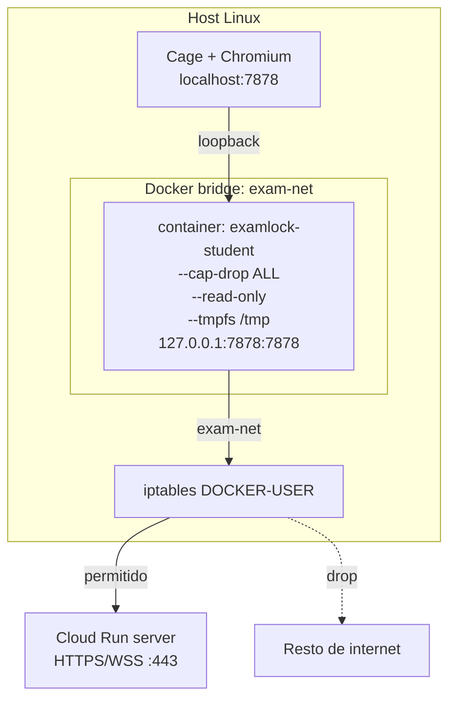

# Red

## Objetivo

La red debe permitir solo lo necesario para que el alumno autentique, sincronice el examen y acceda a los dominios autorizados por el docente. El control real ocurre en el entorno del alumno, no en el navegador.

## Modelo general



## Whitelist

La sesión guarda:

- `whitelist`: dominios configurados por el docente.
- `blockInternet`: si `true`, solo se permite lo necesario y la whitelist.
- `whitelistVersion`: contador para sincronizar cambios.

El server normaliza dominios y emite `server:whitelist` por Socket.IO cuando cambia la configuración.



## ISO / VM

En ISO/VM, el daemon corre con permisos suficientes para aplicar reglas locales. El navegador solo habla con `127.0.0.1:7878`; todo acceso externo pasa por el agent y por las reglas del sistema.



## Modo Lab/Docker



## Crear red Docker

```bash
docker network create \
  --driver bridge \
  --opt com.docker.network.bridge.enable_icc=false \
  exam-net
```

`enable_icc=false` deshabilita comunicación entre containers en la misma red.

## Restricción de salida en Docker

El launcher aplica automáticamente la red `exam-net`. Docker crea la interfaz `br-exam-net`.

Para limitar salida solo al servidor GCP, el técnico puede aplicar (como root):

```bash
# Obtener IP del servidor GCP
GCP_IP=$(dig +short exam-server-xxxx-uc.a.run.app | tail -1)

# Interfaz bridge de exam-net (puede variar)
BR_IF=$(docker network inspect exam-net --format '{{.Id}}' | head -c 12)
BR_IF="br-$BR_IF"

# Eliminar regla FORWARD permisiva por defecto de Docker
iptables -D DOCKER-USER -i "$BR_IF" -j RETURN 2>/dev/null || true

# Solo permite salida hacia el servidor GCP (puerto 443)
iptables -I DOCKER-USER -i "$BR_IF" -d "$GCP_IP" -p tcp --dport 443 -j ACCEPT
iptables -I DOCKER-USER -i "$BR_IF" -d "$GCP_IP" -p tcp --dport 80  -j ACCEPT

# Bloquea todo lo demás saliendo de exam-net
iptables -A DOCKER-USER -i "$BR_IF" -j DROP
```

Cloud Run puede resolver a múltiples IPs y esas IPs pueden cambiar. Para una política estricta por IP, usa una arquitectura con egress fijo o un proxy/control de salida estable.

## Flags del container

| Flag | Efecto |
|------|--------|
| `--cap-drop ALL` | Sin capabilities de Linux (no puede crear sockets raw, no puede modificar iptables, etc.) |
| `--security-opt no-new-privileges` | El proceso no puede ganar privilegios con setuid |
| `--read-only` | Filesystem root de solo lectura |
| `--tmpfs /tmp` | Único directorio escribible, en RAM, se borra al apagar |
| `-p 127.0.0.1:7878:7878` | Puerto solo expuesto en loopback del host, no en red externa |
| `--network exam-net` | Aislado en bridge dedicado |

## Puertos

| Origen | Destino | Puerto | Protocolo |
|---|---|---:|---|
| Chromium kiosk | agent daemon | 7878 | HTTP loopback |
| agent daemon | server | 443 | HTTPS + WSS |
| agent daemon | Firebase Auth | 443 | HTTPS |
| dashboard | server | 443/8080 local | HTTPS/WSS o HTTP dev |
| dashboard | Firebase Auth | 443 | HTTPS |

## Fallas comunes

| Síntoma | Causa probable |
|---|---|
| Login falla antes de llegar al server | Firebase API key/auth domain mal horneados en ISO. |
| Login Firebase OK pero join falla | Código inactivo, rol incorrecto o sesión expirada. |
| Whitelist no cambia | Socket desconectado o daemon sin permisos para aplicar reglas. |
| Cloud Run deja de resolver igual | Regla por IP quedó obsoleta. Usar dominio/proxy/egress fijo. |
