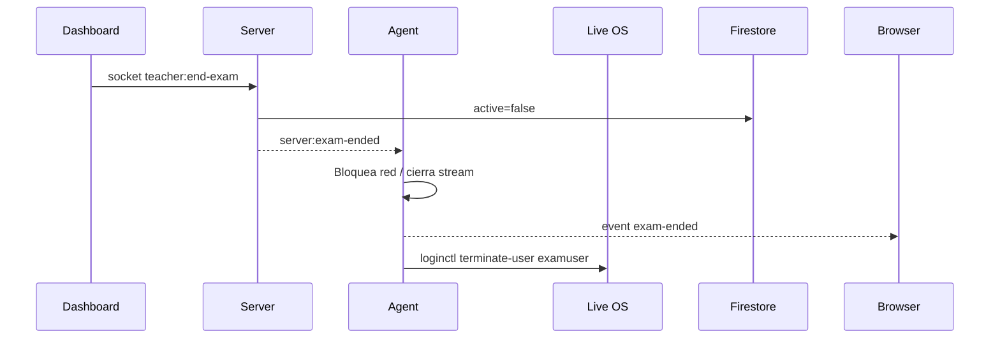

# Operación

## Checklist diario

1. Confirmar que `server` está desplegado y responde.
2. Confirmar que el dashboard apunta al `SERVER_URL` correcto.
3. Crear o validar usuarios Firebase con rol `teacher` y `student`.
4. Crear sesión desde el dashboard.
5. Configurar duración, whitelist y bloqueo de internet.
6. Entregar código de sesión a los alumnos.
7. Monitorear conexión, capturas, stream y eventos.
8. Cerrar sesión al terminar.
9. Revisar auditoría/resultados.

## Usuarios

Los usuarios viven en Firebase Auth. El rol se guarda como custom claim:

- `teacher`: docente/administrador de sesiones.
- `student`: alumno que entra desde el agent.

### Crear usuarios seed

```bash
cd server
SEED_USER_PASSWORD='password-temporal' node scripts/provision-users.js
```

### Cambiar rol

```bash
cd server
node scripts/set-role.js usuario@dominio.com teacher
node scripts/set-role.js usuario@dominio.com student
```

El usuario debe cerrar sesión y volver a entrar después del cambio.

### Borrar un usuario individual

No hay script dedicado para borrar un solo usuario. Opciones actuales:

1. Desde Firebase Console:
   - Authentication
   - Users
   - Buscar correo
   - Delete account

2. Con Firebase Admin en una consola Node temporal:

```bash
cd server
node
```

```js
require('dotenv').config();
const admin = require('firebase-admin');
admin.initializeApp({
  credential: admin.credential.applicationDefault(),
  projectId: process.env.GCP_PROJECT_ID,
});
const user = await admin.auth().getUserByEmail('usuario@dominio.com');
await admin.auth().deleteUser(user.uid);
```

Si también quieres borrar rastros de sesiones, borra o filtra documentos en Firestore donde `students/{uid}` coincida con ese UID y revisa `answers`, `events` y `screenshots`.

### Borrar todos los datos de prueba

Sin borrar usuarios Auth:

```bash
cd server
CONFIRM_RESET=RESET_EXAMLOCK_TEST_DATA node scripts/reset-test-data.js
```

Borrando también usuarios Auth:

```bash
cd server
CONFIRM_RESET=RESET_EXAMLOCK_TEST_DATA node scripts/reset-test-data.js --auth-users
```

Este comando borra sesiones, alumnos, eventos, capturas, preguntas, respuestas y objetos del bucket.

## Crear una sesión

Desde el dashboard:

1. Entrar con un usuario `teacher`.
2. Ir a sesiones.
3. Crear nueva sesión.
4. Definir nombre, duración, whitelist y bloqueo de internet.
5. Compartir el código generado con los alumnos.

El server crea un documento `sessions/{sessionId}` con `code`, `teacherId`, `active`, `endsAt`, `whitelist` y `blockInternet`.

## Alumno entra al examen

1. Arranca desde ISO/VM/kiosk.
2. Ingresa correo, password y código.
3. El agent autentica contra Firebase REST.
4. El agent llama `POST /api/session/:code/join`.
5. El server registra `students/{uid}`.
6. El agent conecta Socket.IO y aplica whitelist.
7. La UI navega a `/exam`.

## Monitoreo

El dashboard puede:

- Ver alumnos conectados.
- Pedir screenshot individual.
- Pedir screenshots a todos los activos.
- Abrir stream en vivo.
- Enviar mensaje overlay.
- Cambiar whitelist durante la sesión.
- Expulsar o readmitir alumnos.
- Revisar auditoría post-examen.

## Cierre

Cuando el docente cierra la sesión:



## Troubleshooting

| Problema | Revisar |
|---|---|
| Alumno no entra | Código activo, rol `student`, hora de `endsAt`, Firebase API key en ISO. |
| Docente no ve sesiones | Rol `teacher`, token refrescado, `teacherId` correcto. |
| Dashboard no conecta | `VITE_SERVER_URL`, CORS en server, Cloud Run URL. |
| Capturas fallan | Dependencias de captura, permisos del usuario, logs del daemon. |
| Whitelist no aplica | Logs del daemon, permisos de firewall, formato de dominios. |
| VM dev no responde | Puerto `2222`, ISO correcta, `./scripts/dev-vm.sh --logs`. |

## Logs útiles

En desarrollo con VM:

```bash
./scripts/dev-vm.sh --logs
```

En la VM:

```bash
journalctl -u examlock-daemon.service -f
tail -f /var/log/examlock/agent.log
```

En server local:

```bash
cd server
npm run dev
```
